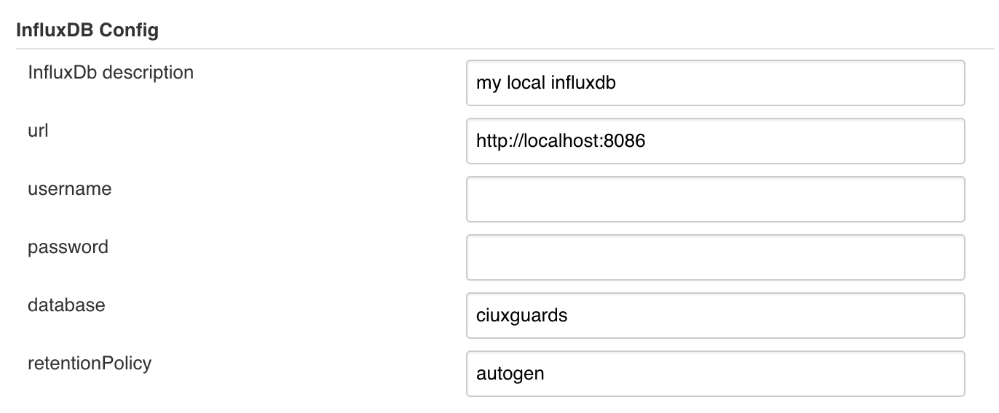

jenkins-build-history-metrics-plugin
====================================

Jenkins plugin to send simple build statistics to InfluxDB

## InfluxDB configuration
Before sending data to InfluxDB connection to InfluxDB needs to be
configured in global jenkins configuration

## Informations send to InfluxDB about jenkins builds
Plugin sends data to an InfluxDB measurement `jenkins_build_data`

Following fields are being send to InfluxDB database

| Field                             | Description                                                                                                                               |
| --------------------------------- | ----------------------------------------------------------------------------------------------------------------------------------------- |
| job_name                          | jenkins job full display name                                                                                                             |
| build_number                      |                                                                                                                                           |
| build_result                      | SUCCESS, UNSTABLE, FAILURE, NOT_BUILT, ABORTED                                                                                            |
| build_timestamp                   | when the build is scheduled for execution                                                                                                 |
| build_duration                    | miliseconds it took to build a job                                                                                                        |
| queuing_duration                  | miliseconds a job spent in a build queue                                                                                                  |
| total_duration                    | build_duration + queuing_duration                                                                                                         |
| build_status_message              | stable, unstable, aborted, not built, back to normal, broken for a long time, broken since this build, broken since build {#build_number} |
| job_owner                         | job's primary owner email                                                                                                                 |
| job_score                         | the percentage health score (from 0 to 100 inclusive).                                                                                    |

Following tags are being send to InfluxDB database

| Tag                        |
| -------------------------- |
| job_name                   |
| build_result               |
| job_owner                  |
| job_score                  |